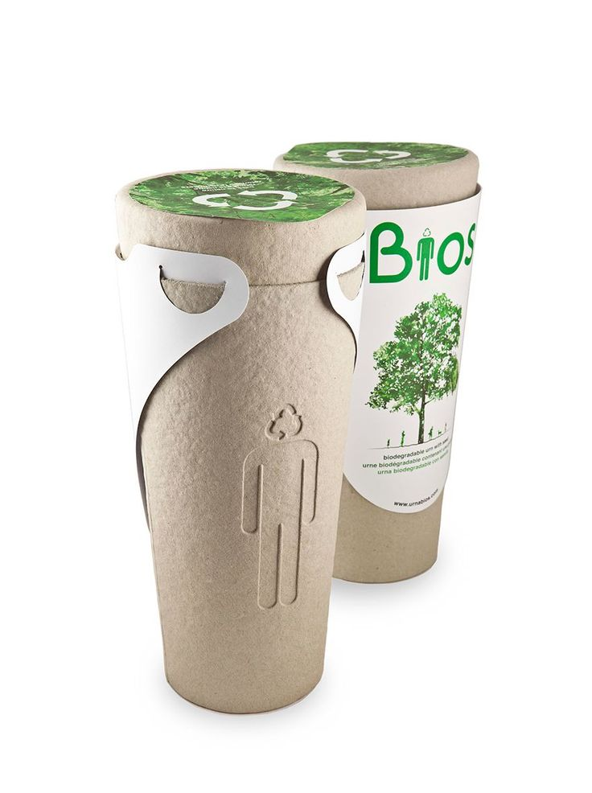

# Estructura Semántica del HTML

La landing page EcoProduct sigue una estructura clara y bien organizada, utilizando etiquetas semánticas para definir cada sección.

## Etiqueta Semanticas Utilizadas:

#### 1. **`<!DOCTYPE html>`**
- Declara que el documento es de tipo HTML5. Es obligatorio para que los navegadores interpreten correctamente el código.

---

#### 2. **`<html lang="es">`**
- Define el idioma principal del documento (español). Esto ayuda a los lectores de pantalla y motores de búsqueda a entender el contenido.

---

#### 3. **`<head>`**
- Contiene metadatos que no se muestran en la página pero son esenciales para su funcionamiento y SEO.
  - `<meta charset="UTF-8">`: Especifica la codificación de caracteres (UTF-8 es estándar y soporta todos los caracteres especiales).
  - `<meta name="viewport" content="width=device-width, initial-scale=1.0">`: Hace que la página sea responsive, adaptándose a diferentes dispositivos.
  - `<title>`: Define el título de la página, que aparece en la pestaña del navegador y en los resultados de búsqueda.
  - `<link rel="stylesheet" href="./css/styles.css">`: Enlaza la hoja de estilos CSS para dar diseño a la página.

---

#### 4. **`<body>`**
- Contiene todo el contenido visible de la página. Está dividido en secciones semánticas.

---

#### 5. **`<header>`**
-   Representa la cabecera de la página. Aquí se incluye la navegación principal y un botón para cambiar el tema (modo oscuro/claro).
  - `<nav>`: Define la barra de navegación. Es semánticamente correcto para agrupar enlaces de navegación.
  - `<ul>` y `<li>`: Lista no ordenada para los enlaces de navegación. Es una práctica común para menús.
  - `<button id="theme-toggle">`: Botón para cambiar el tema. El atributo `aria-label` mejora la accesibilidad al describir su función.

---

#### 6. **`<main>`**
-   Contiene el contenido principal de la página. Es una etiqueta semántica que ayuda a los motores de búsqueda y lectores de pantalla a identificar el contenido principal.

---

#### 7. **`<section>`**
-   Divide el contenido en secciones temáticas. Cada `<section>` tiene un `id` único para facilitar la navegación interna.
  - **`<section id="hero">`**: Es la sección de presentación o "hero". Incluye un título (`<h1>`), un párrafo descriptivo (`<p>`) y un botón de llamado a la acción (`<a>`).
  - **`<section id="caracteristicas">`**: Describe las características principales del producto. Usa `<article>` para cada característica, lo cual es semánticamente correcto para contenido independiente.
  - **`<section id="envios">`**: Detalla las opciones de envío. Usa `<div>` para agrupar contenido relacionado.
  - **`<section id="pagos">`**: Explica los métodos de pago y promociones. También usa `<div>` para organizar el contenido.

---

#### 8. **`<article>`**
-   Se usa dentro de la sección `caracteristicas` para cada característica del producto. Es semánticamente correcto porque cada característica es un contenido independiente y autocontenido.

---

#### 9. **`<footer>`**
-   Representa el pie de página. Aquí se incluye información de contacto, enlaces importantes y redes sociales.
  - `<div class="contact-info">`: Agrupa la información de contacto.
  - `<div class="important-links">`: Contiene enlaces a términos, privacidad y preguntas frecuentes.
  - `<div class="social-media">`: Muestra enlaces a redes sociales. El atributo `aria-label` mejora la accesibilidad.

---

#### 10. **Etiquetas de Texto**
- **`<h1>` a `<h3>`**: Se usan para títulos y subtítulos. Siguen una jerarquía lógica (`<h1>` para el título principal, `<h2>` para secciones y `<h3>` para subsecciones), lo que mejora la accesibilidad y el SEO.
- **`<p>`**: Para párrafos de texto descriptivo.
- **`<ul>` y `<li>`**: Para listas no ordenadas, como opciones de envío y métodos de pago.

---

#### 11. **Atributos de Accesibilidad**
- **`aria-current="page"`**: Indica que el enlace "Inicio" corresponde a la página actual.
- **`aria-label`**: Proporciona una descripción accesible para el botón de cambio de tema y los enlaces de redes sociales.
- **`alt` en ``**: Describe las imágenes para usuarios con discapacidad visual.

---

#### 12. **Script de Cambio de Tema**
-   El script en `<script>` permite cambiar entre modo oscuro y claro. Usa `classList.toggle` para alternar la clase `dark-mode` en el elemento `<html>`.

## Break Points
Se implemento nuevas secciones como Galeria de Fotos y Testimonios, de las cuales se agregaron los siguientes estilos y media querys.
### HTML
```html
<section id="galeria">
            <h2>Galería de Imágenes</h2>
            <div class="gallery-flex">
                
                
                
                
                
                
                
                
            </div>
        </section>
        <section id="testimonios">
            <h2>Testimonios de Clientes</h2>
            <div class="testimonials-flex">
                <article class="testimonial-card">
                    <p>"Este producto ha cambiado mi vida para mejor. ¡Altamente recomendado!"</p>
                    <h4>- Juan Pérez</h4>
                </article>
                <article class="testimonial-card">
                    <p>"La calidad es excelente y el servicio al cliente es inmejorable."</p>
                    <h4>- María López</h4>
                </article>
                <article class="testimonial-card">
                    <p>"Sostenible y duradero, justo lo que estaba buscando."</p>
                    <h4>- Carlos García</h4>
                </article>
                <article class="testimonial-card">
                    <p>"Este producto ha cambiado mi vida para mejor. ¡Altamente recomendado!"</p>
                    <h4>- Alex Díaz</h4>
                </article>
                <article class="testimonial-card">
                    <p>"La calidad es excelente y el servicio al cliente es inmejorable."</p>
                    <h4>- Mario Campos</h4>
                </article>
                <article class="testimonial-card">
                    <p>"Sostenible y duradero, justo lo que estaba buscando."</p>
                    <h4>- Alexander Gomez</h4>
                </article>
            </div>
        </section>
```
### CSS
```css
#galeria {
    background-color: var(--color-light);
    padding: var(--spacing-lg) 0;
    text-align: center;
}

#galeria h2 {
    font-size: 2.5rem;
    color: var(--color-dark);
    margin-bottom: var(--spacing-lg);
    position: relative;
}

#galeria h2::after {
    content: '';
    position: absolute;
    bottom: -10px;
    left: 50%;
    transform: translateX(-50%);
    width: 80px;
    height: 4px;
    background: var(--color-primary);
    border-radius: 2px;
}

.gallery-flex {
    display: flex;
    flex-wrap: wrap;
    justify-content: center;
    gap: var(--spacing-md);
    max-width: var(--container-max-width);
    margin: 0 auto;
    padding: 0 var(--spacing-lg);
}

.gallery-flex img {
    flex: 1 1 calc(25% - var(--spacing-md));
    max-width: calc(25% - var(--spacing-md));
    height: auto;
    border-radius: 12px;
    box-shadow: 0 5px 15px rgba(0, 0, 0, 0.1);
    transition: transform 0.3s ease, box-shadow 0.3s ease;
}

.gallery-flex img:hover {
    transform: scale(1.05);
    box-shadow: 0 10px 20px rgba(0, 0, 0, 0.15);
}

/*Testimonios*/
#testimonios {
    background-color: var(--color-white);
    padding: var(--spacing-lg) 0;
    text-align: center;
}

#testimonios h2 {
    font-size: 2.5rem;
    color: var(--color-dark);
    margin-bottom: var(--spacing-lg);
    position: relative;
}

#testimonios h2::after {
    content: '';
    position: absolute;
    bottom: -10px;
    left: 50%;
    transform: translateX(-50%);
    width: 80px;
    height: 4px;
    background: var(--color-primary);
    border-radius: 2px;
}

.testimonials-flex {
    display: flex;
    flex-wrap: wrap;
    justify-content: center;
    gap: var(--spacing-md);
    max-width: var(--container-max-width);
    margin: 0 auto;
    padding: 0 var(--spacing-lg);
}

.testimonial-card {
    flex: 1 1 calc(33% - var(--spacing-md));
    max-width: calc(33% - var(--spacing-md));
    background-color: var(--color-light);
    padding: var(--spacing-md);
    border-radius: 12px;
    box-shadow: 0 5px 15px rgba(0, 0, 0, 0.1);
    transition: transform 0.3s ease, box-shadow 0.3s ease;
}

.testimonial-card:hover {
    transform: scale(1.05);
    box-shadow: 0 10px 20px rgba(0, 0, 0, 0.15);
}

.testimonial-card p {
    font-size: 1.1rem;
    color: var(--color-dark);
    margin-bottom: var(--spacing-sm);
}


.testimonial-card h4 {
    font-size: 1rem;
    color: var(--color-secondary);
}

.dark-mode .testimonial-card p {
    color: #ffffff;
}

@media (max-width: 768px) {
    .testimonial-card {
        flex: 1 1 calc(50% - var(--spacing-md));
        max-width: calc(50% - var(--spacing-md));
    }
}

@media (max-width: 480px) {
    .testimonial-card {
        flex: 1 1 100%;
        max-width: 100%;
    }
}
@media (max-width: 768px) {
    .features-grid, .shipping-options, .payment-options ul {
        grid-template-columns: 1fr;
    }

    .footer-container {
        grid-template-columns: 1fr;
        text-align: center;
    }

    .footer-container h2::after {
        left: 50%;
        transform: translateX(-50%);
    }

    .social-media ul {
        justify-content: center;
    }

    .gallery-flex img {
        flex: 1 1 calc(50% - var(--spacing-md));
        max-width: calc(50% - var(--spacing-md));
    }
}

@media (max-width: 480px) {
    .gallery-flex img {
        flex: 1 1 100%;
        max-width: 100%;
    }

    .cta-button {
        width: 90%;
        text-align: center;
        padding: 1rem;
    }
}
```

## Framework CSS (Bootstrap / Tailwind CSS)

### 쯖on qué librería/framework te sentiste más cómodo trabajando y por qué (Bootstrap / Tailwind CSS)?
En mi experiencia desarrollando con bootstrap y tailwind CSS, me sentí mas comodo con Tailwind CSS debido a que flexibilidad a diseños personalizados. Sin embargo hay que destacar lo siguiente, si vas a desarrollar una pagina web o un app web, donde el diseño se destaca, lo más recomandable seria utilizar Tailwind CSS. Pero si vas a desarrollar una app web con alta complejidad, las funcionalidad seran repetitivas, y con un grupo de personas lo más recomendable es utilizar Bootstrap debido a diseños ya predefinidos y facil de utilizar.

### Comandos utilizados para crear, cambiar y fusionar las ramas
```sql
--Para crear rama
git branch bootstrap
git branch tailwind

--Para cambiar de una rama a otra rama
git checkout bootstrap
git checkout tailwind

--Para realizar merge
git merge bootstrap
git merge tailwind
```

## 🎯 Retos
Cada estudiante deberá implementar al menos 2 nuevas Historias de Usuario y demostrar su funcionamiento en la presentación.

### HU1: Tarjetas de Beneficios (Tailwind)
Como visitante del sitio, quiero ver los beneficios del producto en tarjetas interactivas para entender mejor las ventajas de manera visual y atractiva.

Criterios de Aceptación:

1. Mostrar 4 tarjetas con iconos y texto.
2. Efecto hover con cambio suave de color.
3. Diseño responsive (1 columna en moviles, 2 columnas en tablest, 4 en desktop).
4. Iconos representativos para cada beneficio.

### Desarrollo
El desarrollo se realizo en la rama hu1 para lo cual se utilizaron los siguientes comando para su creación y acceso.
```sql
/*Para crear rama*/
git branch hu1
/*Para acceder a la rama*/
git checkout hu1
```
#### **index.html**
```html
<section id="beneficios" class="py-20 bg-white">
        <h2 class="text-4xl font-bold text-center mb-16 relative">
            Beneficios Principales
            <span class="absolute bottom-0 left-1/2 transform -translate-x-1/2 w-20 h-1 bg-primary"></span>
        </h2>
        <div class="container mx-auto px-4 grid grid-cols-1 md:grid-cols-2 lg:grid-cols-4 gap-8">
            <!-- Tarjeta 1 -->
            <div class="bg-light rounded-xl p-6 hover:bg-primary hover:text-white transition-all duration-300 transform hover:-translate-y-2">
                <div class="text-4xl mb-4">🌱</div>
                <h3 class="text-xl font-semibold mb-2">Eco-Friendly</h3>
                <p>100% biodegradable y respetuoso con el medio ambiente</p>
            </div>

            <!-- Tarjeta 2 -->
            <div class="bg-light rounded-xl p-6 hover:bg-primary hover:text-white transition-all duration-300 transform hover:-translate-y-2">
                <div class="text-4xl mb-4">♻️</div>
                <h3 class="text-xl font-semibold mb-2">Reciclable</h3>
                <p>Materiales completamente reciclables y reutilizables</p>
            </div>

            <!-- Tarjeta 3 -->
            <div class="bg-light rounded-xl p-6 hover:bg-primary hover:text-white transition-all duration-300 transform hover:-translate-y-2">
                <div class="text-4xl mb-4">💪</div>
                <h3 class="text-xl font-semibold mb-2">Duradero</h3>
                <p>Diseñado para una larga vida útil y resistencia</p>
            </div>

            <!-- Tarjeta 4 -->
            <div class="bg-light rounded-xl p-6 hover:bg-primary hover:text-white transition-all duration-300 transform hover:-translate-y-2">
                <div class="text-4xl mb-4">🌍</div>
                <h3 class="text-xl font-semibold mb-2">Impacto Global</h3>
                <p>Contribuye a la reducción de la huella de carbono</p>
            </div>
        </div>
    </section>
```

### HU2: Galería de Productos (Bootstrap)
Como cliente potencial, quiero ver una galería de imágenes del producto en formato carrusel para visualizar mejor los detalles y diferentes ángulos.

Criterios de Aceptación:

1. Carrusel con controles de navegación.
2. Indicadores de posición.
3. Transiciones suaves entre imágenes.
4. Adaptable a diferentes tamaños de pantalla.

### Desarrollo
El desarrollo se realizo en la rama hu2 para lo cual se utilizaron los siguientes comando para su creación y acceso.
```sql
/*Para crear rama*/
git branch hu2
/*Para acceder a la rama*/
git checkout hu2
```
#### **compra.html**
```html
<div class="col-md-8">
    <h1 class="mb-4">EcoProduct</h1>
    
    <div id="productCarousel" class="carousel slide mb-4" data-bs-ride="carousel">
        <div class="carousel-indicators">
            <button type="button" data-bs-target="#productCarousel" data-bs-slide-to="0" class="active"></button>
            <button type="button" data-bs-target="#productCarousel" data-bs-slide-to="1"></button>
            <button type="button" data-bs-target="#productCarousel" data-bs-slide-to="2"></button>
            <button type="button" data-bs-target="#productCarousel" data-bs-slide-to="3"></button>
        </div>
        
        <div class="carousel-inner rounded-4">
            <div class="carousel-item active">
                
            </div>
            <div class="carousel-item">
                
            </div>
            <div class="carousel-item">
                
            </div>
            <div class="carousel-item">
                
            </div>
        </div>
        
        <button class="carousel-control-prev" type="button" data-bs-target="#productCarousel" data-bs-slide="prev">
            <span class="carousel-control-prev-icon"></span>
            <span class="visually-hidden">Anterior</span>
        </button>
        <button class="carousel-control-next" type="button" data-bs-target="#productCarousel" data-bs-slide="next">
            <span class="carousel-control-next-icon"></span>
            <span class="visually-hidden">Siguiente</span>
        </button>
    </div>

    <div class="row g-2 thumbnail-grid">
        <div class="col-3">
            
        </div>
        <div class="col-3">
            
        </div>
        <div class="col-3">
            
        </div>
        <div class="col-3">
            
        </div>
    </div>
</div>
```

#### **compra.css**
```css
.carousel-item img {
    height: 400px;
    object-fit: cover;
}

.thumbnail-grid img {
    height: 80px;
    object-fit: cover;
    cursor: pointer;
    transition: opacity 0.3s ease;
}

.thumbnail-grid img:hover {
    opacity: 0.8;
}

.carousel-indicators {
    margin-bottom: -1rem;
}

.carousel-indicators button {
    width: 10px;
    height: 10px;
    border-radius: 50%;
}
```

#### **compra.js**
```javascript
function showSlide(index) {
    const carousel = new bootstrap.Carousel(document.getElementById('productCarousel'));
    carousel.to(index);
}
```